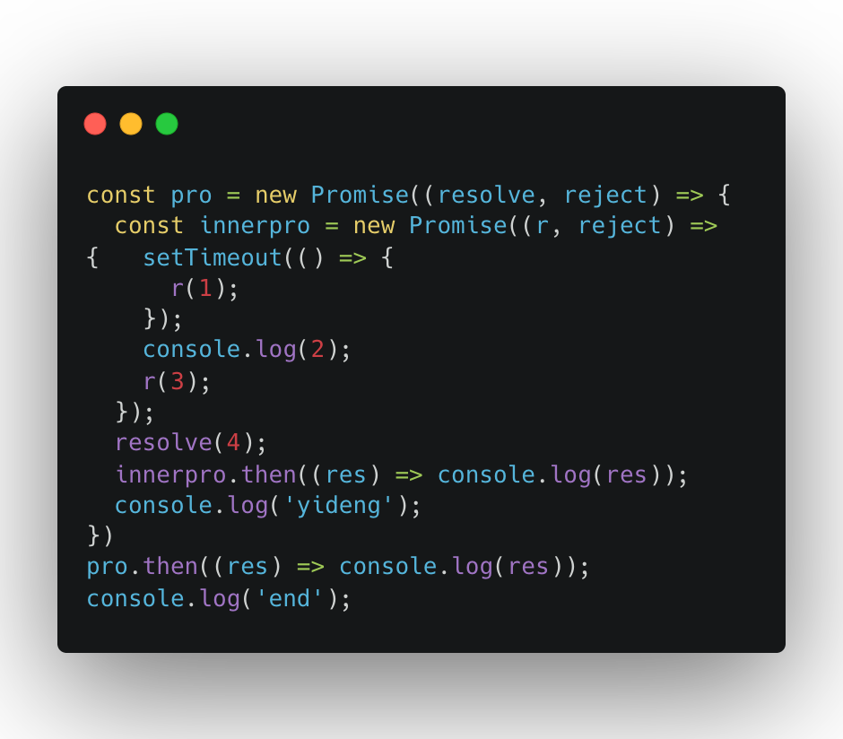

# 1.请说明如下代码打印顺序和原因



```Typescript
const pro = new Promise((resolve, reject) => {
  // 创建 Promise, 这里的代码立即执行, 但 resolve/reject 的结果是异步的
  const innerpro = new Promise((r, reject) => {
    // 创建 Promise, 这里的代码立即执行, 但 resolve/reject 的结果是异步的
    setTimeout(() => {  // 这是一个宏任务
      r(1); // 代表当前 promise 成功了, 值是 1, 可以通过 .then 拿到这个值, .then 是个微任务
    });
    console.log(2);  // 这是一个同步任务, 立即执行
    r(3);  // 代表当前 promise 成功了, 值是 3, 可以通过 .then 拿到这个值, .then 是个微任务
  });

  resolve(4);  // 代表当前 promise 成功了, 值是 4, 可以通过 .then 拿到这个值, .then 是个微任务
  innerpro.then((res) => console.log(res));  // 打印 innerpro.then 拿到的是 3, 注册成微任务
  console.log('yideng');  // 同步任务立即执行
});

pro.then((res) => console.log(res));  // 打印 Promise.then 拿到的是 4, 注册成微任务
console.log('end');  // 同步任务立即执行
```

2 => yideng => end => 3 => 4

2, yideng, end, 3, 4

# 2. 933. 最近的请求次数

https://leetcode.cn/problems/number-of-recent-calls/description/

1 - queue shift

```typescript
class RecentCounter {
  counter: number[];
  constructor() {
    this.counter = [];
  }

  ping(t: number): number {
    this.counter.push(t);
    // 因为 t 是严格递增的, 所以不用考虑查询历史的问题, 可以安全的把当前 t-3000 前的扔掉
    while (this.counter[0] < t - 3000) {
      this.counter.shift();
    }
    return this.counter.length;
  }
}

/**
 * Your RecentCounter object will be instantiated and called as such:
 * var obj = new RecentCounter()
 * var param_1 = obj.ping(t)
 */
```

2 - 双指针/滑动窗口

```Typescript
class RecentCounter {
    counter: number[] = [];
    pointer: number = 0;

    ping(t: number): number {
        this.counter.push(t)
        // 因为 t 是严格递增的, 所以不用考虑查询历史的问题, 可以安全的把当前 t-3000 前的扔掉
        while (this.counter[this.pointer] < t-3000) {
            this.pointer++;
        }
        return this.counter.length - this.pointer;
    }
}
// 时间复杂度 O(1), while 进入次数也就是 pointer 移动次数 < counter 大小(元素个数 n), 所以总 pointer 移动次数是 O(n), 内部操作 O(1), 总的 O(n), 摊到每一次 ping() 就是 O(1).
// 空间复杂度 O(n)

/**
 * Your RecentCounter object will be instantiated and called as such:
 * var obj = new RecentCounter()
 * var param_1 = obj.ping(t)
 */
```
